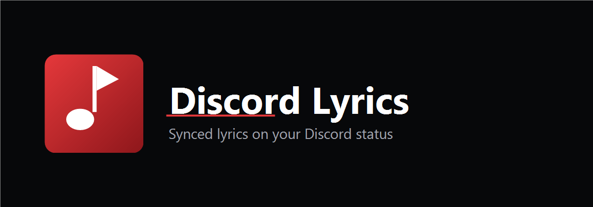

<div align="center">



# Discord Lyrics

**A letra sincronizada da sua música, ao vivo no seu status do Discord.**

<br/>

[](https://github.com/Overocai/Discord-Lyrics-Status/releases/latest/download/DiscordLyrics-Setup.exe)
&nbsp;&nbsp;
[](README.md)

<sub>Windows 10/11 · ao clicar em <b>Instalar Agora</b> o instalador baixa automaticamente</sub>

</div>

<br/>

<details>
<summary><b>Informações para desenvolvedores &amp; build</b> (clique para expandir)</summary>

<br/>

Reescrita completa em C# / .NET 9 / WPF — MVVM, injeção de dependência, SQLite/EF Core,
Serilog, um design system escuro/vermelho próprio e um instalador profissional (Inno Setup).

> ⚠️ Apenas para fins educacionais. O programa automatiza uma conta de *usuário* do Discord
> (comportamento de selfbot), o que pode violar os Termos de Serviço do Discord. Seu token é
> guardado criptografado (Windows DPAPI) na sua máquina e nunca é enviado para lugar nenhum.

### Rodar a partir do código
```bash
dotnet run --project DiscordLyrics/DiscordLyrics.csproj
```

### Gerar um executável self-contained
```bash
dotnet publish DiscordLyrics/DiscordLyrics.csproj -c Release -r win-x64 ^
    --self-contained true -p:PublishSingleFile=true -o publish
```

### Gerar o instalador
1. Instale o [Inno Setup 6](https://jrsoftware.org/isdl.php)
2. Publique o app (comando acima) para criar a pasta `publish/`
3. `iscc DiscordLyrics/Installer/DiscordLyrics.iss` → `dist/DiscordLyrics-Setup.exe`
4. Suba o `DiscordLyrics-Setup.exe` como anexo numa Release do GitHub — aí o botão **Instalar Agora** passa a funcionar.

### Documentação
- [Arquitetura](docs/ARCHITECTURE.md) · [Design System](docs/DESIGN_SYSTEM.md) · [Wireframes](docs/WIREFRAMES.md) · [Estratégia de update](docs/UPDATE_STRATEGY.md) · [Roadmap](docs/ROADMAP.md)

### Autor
**Overocai** · [GitHub](https://github.com/Overocai) · [Discord](https://discord.com/users/1288832011452153910)

</details>
